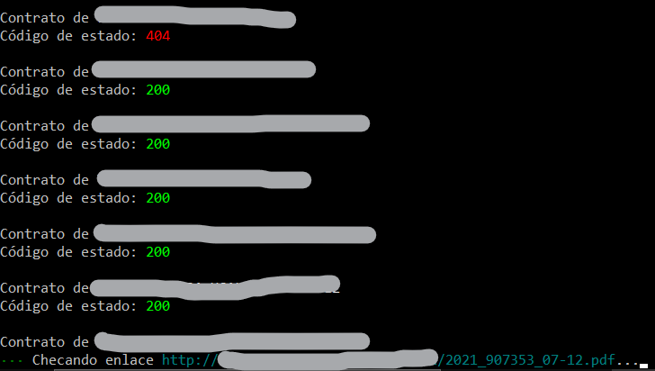
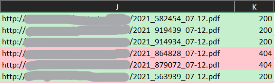

# TL;DR

A simple script to check if online files are available, by reading an Excel file and sending a HEAD request to an URL to get its status code.
Made to automate a task.

# Situation

There's an Excel file that contains data about a type of documents.
One of the columns is the URL of the online PDF for each document.
But it is known that some PDFs don't exist so those links are broken.

Previously, somebody had to copy and paste each link or a batch of links to a website like [httpstatus.io](https://httpstatus.io/)
and then manually add a note for each one indicating if it's available.
Then, the records with broken links needed to be filtered and moved to a new Excel file.

The file has around 1200 records, and it's updated each month, so it's possible that different links are broken.

# Task

I thought of writing a script to check if the availability of the PDFs.
The idea was simple: read an Excel file, send a request to each link, and mark them as available or not in a new column.
Also the script had to be reusable because of the monthly updates to the file.

# Action

## Logic

First I wanted to analyze the file using code instead of the Excel app, so I read the
[Pandas docs to read Excel files](https://pandas.pydata.org/pandas-docs/stable/reference/api/pandas.read_excel.html).
I was using a DataFrame at first to iterate over the URLs, but I found out that Pandas doesn't maintain
the style nor the specific format of the file, or at least I didn't find any resources about that during a quick search.
This was important because the file had to have the same format.
So I decided to not bother in doing a deeper search about the lost style with Pandas, and instead looked for an alternative.

Out of the engines that Pandas uses to read Excel files, [OpenPyXL](https://openpyxl.readthedocs.io/en/stable/) is the only one that supports the `.xlsx` extension.
I started to look at their documentation but in my opinion it's very incomplete.
Fortunately I found some good examples in Stack Overflow and I sticked with the library.

To send the URL requests I was going to use [Requests](https://github.com/psf/requests), but I rather used [AIOHTTP](https://github.com/aio-libs/aiohttp) because it's asynchronous. 
Because the links point to an online PDF, the script sends a HEAD request so it doesn't have to download the actual file.
It only checks for the status code of that URL.

After getting the status code, it is added to the new column in the same row of that link, and both cells get their background colored.
If the status code is 200 they'll be green, otherwise, the color will be reddish pink and that record will be added to the new Excel file.

## User interface

Because the script is meant to be used by a non-developer person, I didn't want to make it an arguments based CLI.
A GUI would have been too much for this.
So I was going to make it an interactive CLI, but because the only input is the Excel file, I decided to use Tkinter to browse it only.
The rest is just verbosity about the process being printed in the console, using [Rich](https://github.com/willmcgugan/rich) for colors and status bars.

The text printed in console is in Spanish.

## Deliverable

The PC of the user doesn't have Python installed, and it would just be a hassle to install it, so I used [PyInstaller](https://github.com/pyinstaller/pyinstaller) to make a Windows executable.

# Result

Now the user doesn't have to bother to copy and paste all the links in a website, and then copying and pasting the results back to the file, and then filtering them.

I learned how to manipulate Excel files using Python, and that I prefer CSVs and Pandas.
I also used the Rich package for the first time, and it's great.

## Screenshots

As you can imagine the file contains sensitive data.

Output in console:

Excel file after running the script:

